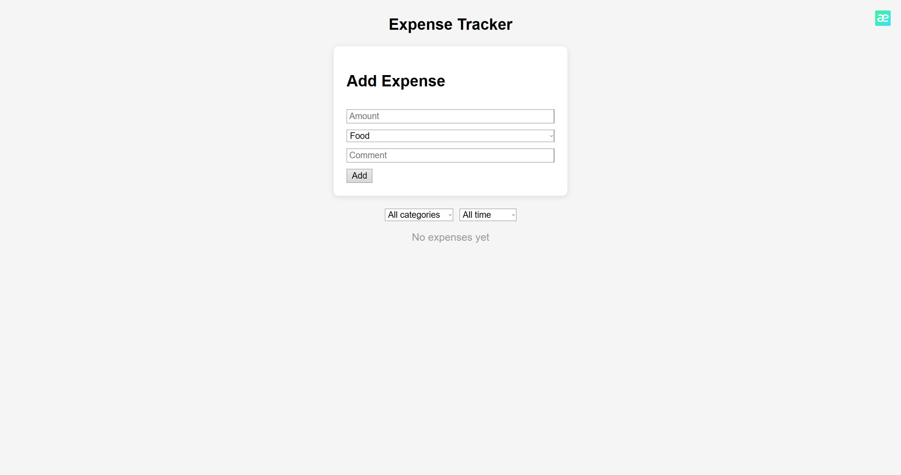

# Expense Tracker

A single-page React application for tracking personal expenses with filtering
and category-based analytics. Data is persisted locally in the browser.

## Features
- Add, edit and delete expenses
- Controlled form with input validation
- Filter by category and month
- Category summary with percentage breakdown
- Data persistence via localStorage

## Tech Stack
- React 18 (hooks: useState, useEffect, useMemo)
- Vite
- Plain CSS (no UI libraries)

## Getting Started
npm install
npm run dev

## What I Learned / Key Concepts
- Lifting state up and passing callbacks to child components
- Controlled forms and conditional rendering
- Immutable state updates (spread, filter, map)
- Persisting state to localStorage with lazy initialization
- Memoized derived data with useMemo

Live Demo https://expense-tracker-kappa-nine-29.vercel.app